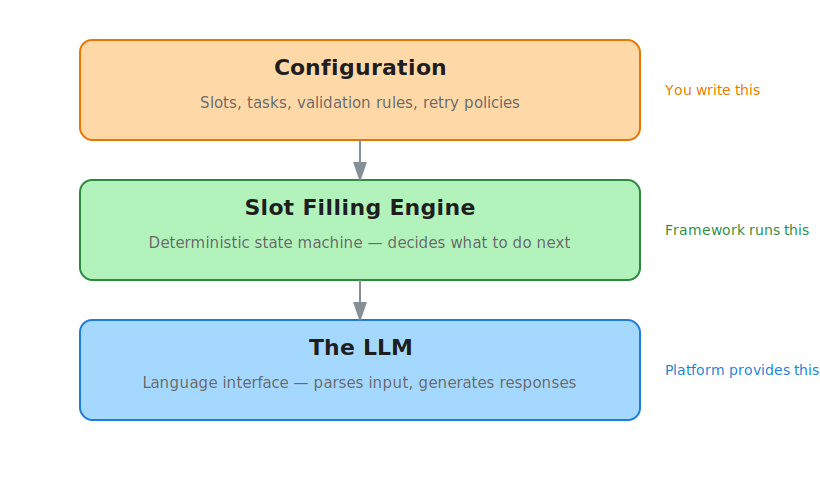
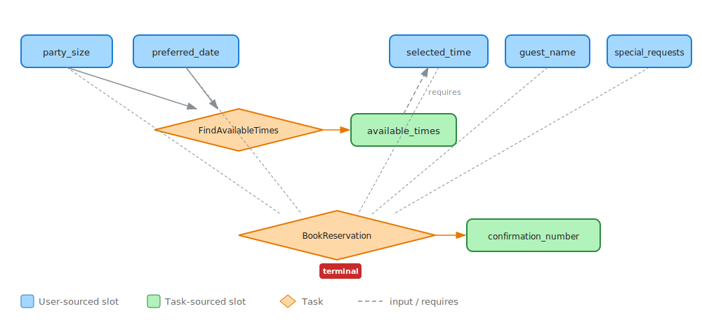

# Slot Filling

Most conversational agents need to collect structured information from users — a date, a name, a phone number, a preference. Slot filling is the framework for doing this reliably, without relying on the LLM to make control-flow decisions.

The Slot Filling DAG Framework gives you a declarative way to define *what* data your agent needs, *how* to validate it, *when* to fire backend tasks, and *what to do when things go wrong*. The LLM handles natural language — understanding what the user said and generating human-sounding responses. Python handles everything else.

---

!!! tip "Pattern overview"
    For a high-level architectural overview of the Slot Filling Pattern — including the problem it solves, the LLM-vs-Python split, and the seven production stabilization gotchas — see the [Slot Filling Pattern](../../patterns/slot-filling.md) page.

## Why a framework?

Without slot filling, building a data-collection agent means writing complex prompt instructions that tell the LLM to track which fields it has, which it still needs, when to call backend APIs, and how to handle errors. This works for simple cases, but breaks down quickly:

- The LLM forgets to ask for required fields
- It asks for the same information twice
- It calls a backend API before all inputs are ready
- It doesn't retry on failure, or retries forever
- It skips confirmation when you need it

The Slot Filling DAG Framework solves these problems by moving control flow out of the LLM and into deterministic Python. The LLM becomes a *language interface* — it parses what the user says and generates natural responses — while the framework decides what happens next.

---

## The mental model

Think of slot filling as three layers working together:

<figure class="diagram">
  
  <figcaption>The three layers of slot filling — configuration declares intent, the engine makes decisions, the LLM speaks human.</figcaption>
</figure>

**Configuration** is a Python dictionary that declares your slots (data to collect), tasks (backend operations to run), and policies (validation rules, retry limits, escalation paths). You write this once per agent.

**The Engine** is a deterministic state machine. Each conversational turn, it evaluates the current state — which slots are filled, which are pending, which tasks have run — and decides exactly one action: ask the next question, fire a task, request confirmation, or escalate. It never guesses.

**The LLM** receives the engine's decision as a system instruction suffix and tool visibility constraints. It can only see tools that are valid right now — if a slot is already filled, its setter tool is hidden. If a task's inputs aren't ready, its executor tool is hidden. The LLM translates between the user's natural language and the framework's structured tool calls.

---

## Key concepts at a glance

Before diving into the tutorial, here are the core building blocks:

### Slots

A **slot** is a named piece of data your agent needs. Each slot has a *source* that determines how it gets filled:

| Source | How it fills | Example |
|--------|-------------|---------|
| `"user"` | User provides the value via a setter tool | Party size, guest name |
| `"task:TaskName"` | Populated when a backend task succeeds | Available times, confirmation number |
| `"event"` | Pre-filled from external data (telephony, CRM) | Caller ID, account number |
| `"announce"` | Framework delivers a message, no user input needed | Welcome greeting, legal disclosure |

User-sourced slots have a **setter tool** — a small Python function that validates the input and returns a structured result. The LLM calls the setter; the framework routes the result into state.

### Tasks

A **task** is a backend operation that fires when all its input slots are filled. Tasks connect user data to system-derived data:

```
[party_size] + [preferred_date]  →  FindAvailableTimes  →  [available_times]
```

Tasks declare their inputs, outputs, success criteria, and failure handling. The framework fires them automatically — the LLM never decides when to call a backend API.

### The DAG

Slots and tasks together form a **directed acyclic graph**. Slots are nodes, tasks are edges, and `requires` declarations enforce ordering. The framework walks this graph to determine what to do next:

<figure class="diagram">
  
  <figcaption>A reservation agent's DAG — user-sourced slots feed into tasks, which produce task-sourced slots.</figcaption>
</figure>

### Readback and confirmation

For critical data, slots can require **readback** — the agent repeats the value back to the user for confirmation before committing it. The framework handles the full lifecycle: collecting the value, presenting it for confirmation, accepting corrections, and promoting confirmed values to `filled`.

### Validation and retries

Each slot can declare validation rules with error messages, retry limits, and escalation paths. When validation fails, the framework delivers the right error message and tracks retry counts. When retries are exhausted, it escalates — transferring to a human agent, ending the session, or taking whatever action you configure.

---

## Who owns what

This table captures the most important design principle in slot filling — the split between what the LLM controls and what Python controls:

| Concern | Owner | How |
|---------|-------|-----|
| Understanding user intent | LLM | Selects which setter tool to call |
| Parsing values from natural language | LLM | Converts "next Thursday" to `2026-06-19` |
| Generating natural responses | LLM | Wraps framework decisions in human language |
| Deciding what to ask next | Python | DAG evaluation in declaration order |
| Deciding when to fire a task | Python | Input readiness check |
| Counting retries and escalating | Python | `_retries` dict + `max_retries` config |
| Preventing invalid tool calls | Python | Tool visibility (hide/show per turn) |
| Handling validation errors | Python | Config-driven error messages |
| Short-circuiting confirmation | Python | Auto-confirm on "yes", "correct", etc. |

**The LLM is a language interface, not a state machine.** If the framework enforces a constraint, don't also prompt for it — duplicate constraints cause the LLM to second-guess the framework.

---

## What you'll build

The guides in this section walk you through building a complete restaurant reservation agent — **Bella Notte** — step by step. You'll start with two simple slots and progressively add validation, tasks, readback, conditional logic, and error handling until you have a production-ready agent.

<div class="grid cards" markdown>

-   **Tutorial**

    ---

    Build a reservation agent from scratch, adding one concept at a time. Start with two slots, end with a full DAG including tasks, readback, validation, and error handling.

    [Start the tutorial &rarr;](tutorial.md)

-   **Advanced Patterns**

    ---

    Conditional slots, deferred readback groups, event-driven pre-filling, announce slots, and the engine's preemption and stall-detection mechanisms.

    [Advanced patterns &rarr;](advanced.md)

-   **Configuration Reference**

    ---

    Complete reference for every field in the slot, task, and global configuration. Copy-paste-ready templates for common patterns.

    [Configuration reference &rarr;](reference.md)

</div>
